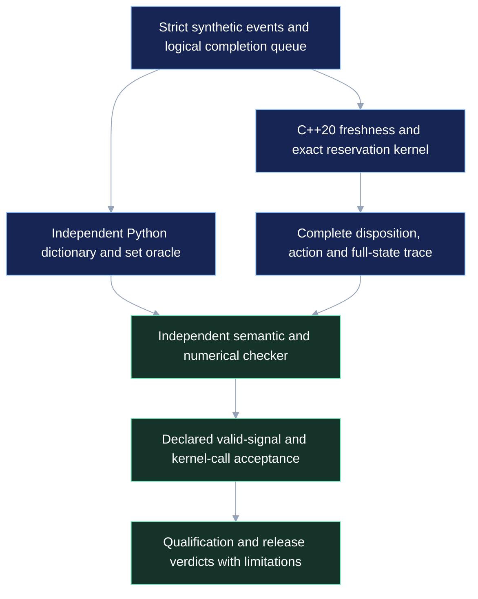

# Apex QuantFabric

**Qualify a financial model/runtime change against signal freshness, exact admission state and complete result accounting.**

This first implementation is a synthetic workstation release gate: a C++20 native kernel, independently authored Python oracle, bounded logical completion queue, seeded fixtures, baseline/candidate replay and an evidence verifier. It works without a GPU, SmartNIC or FPGA. It is not a live trading engine, an official STAC implementation, a profitability claim or an NVIDIA partnership.

The initial profile is [`apex.quant.signal-reservation@0.1`](contracts/signal-reservation-v0.1.json): eight instruments, sixteen reservation slots, sixteen units per instrument, up to eight queued logical completions and 256 prediction identities per session. Floating-point model acceptance and exact downstream decisions are checked separately. See the [frozen contract](docs/CONTRACT.md) and [implementation status](docs/STATUS.md).

## Reproduce

Python 3.11+ and a C++20 compiler are required. Runtime and tests use Python's standard library; no CUDA/DOCA downloads or third-party C++ JSON library are needed.

```bash
make test
make demo
python3 -m qualification.verify evidence/runs/demo
make qualify
python3 -m qualification.verify evidence/runs/million
```

The output directory must be new. A run never overwrites an existing evidence bundle. `make qualify` offers exactly 250,000 events under each of four seeds: one million fixture events, checked against both baseline and candidate, producing two million positive native transitions. The directed controls are included in each seed, so repeated directed events are explicitly part of that population; this is not a million unique market situations.

On the recorded macOS machine, the selected compiler and default Command Line Tools SDK were mismatched. The successful local build uses its matching Xcode SDK explicitly:

```bash
make test QF_SYSROOT=/Applications/Xcode.app/Contents/Developer/Platforms/MacOSX.platform/Developer/SDKs/MacOSX15.2.sdk
```

That path is a local environment fact, not a portable requirement. Linux CI uses its installed C++20 compiler normally.

## A release decision you can inspect

Each prediction binds session, instrument, input watermark, model/policy/configuration, expiry and quantity. The kernel validates those fields, checks numerical policy and atomically reserves a permitted action. A duplicate cannot recommit. An uncertain output retains its reservation until an explicit terminal release. Reset cannot discard outstanding obligations.

The public toy predictor is `((integer_price % 101) - 50) / 50`. It demonstrates numerical acceptance and threshold behavior; it is not a trained model or trading strategy. The candidate adds `1e-8` to its score. It qualifies on the published fixture margins, while a separate near-threshold test proves that this small numerical difference can still fail decision equivalence.

The checker compares **every disposition, action and full state** to the separate dictionary/set oracle. It also detects deliberately broken freshness, expiry, session, reservation, duplicate, threshold and numerical variants, and tampered/missing/extra trace rows. Fault variants are qualification controls, not deployable backends.

Two verdicts remain distinct:

- `verdict`: positive semantic checks passed and all requested negative controls were detected.
- `release_verdict`: positive runs also meet the declared minimum valid-signal count and optional instrumented kernel p99 ceiling.

An operator can reject a correct candidate using a declared budget:

```bash
python3 -m qualification.run --events 5000 --controls \
  --maximum-kernel-p99-ns 0 --output evidence/runs/budget-rejection
```

This intentionally unrealistic ceiling illustrates a failed release gate. The CLI exit code covers qualification integrity; inspect `release_verdict` for release acceptance. Kernel-call timing excludes parsing, queueing, prediction, serialization and transport. Native replay wall time has a separate, broader file-processing boundary. Neither establishes application wire latency. [Evidence protocol](docs/EVIDENCE.md).

## Architecture



Eight [Mermaid architecture sources](docs/ARCHITECTURES.md) cover portfolio seams, target boundaries, research-to-release, admission, evidence, commercial ownership, hardware access and partnership. The broader hardware and enterprise branches remain proposed.

## Apex ecosystem

| Project | Preserved thesis | QuantFabric seam/status |
|---|---|---|
| [Apex_ContractForge](https://github.com/AAH20/Apex_ContractForge) | Bounded implementation and qualification | Methodological connection; no source or proof inherited |
| [Apex_Tick](https://github.com/AAH20/Apex_Tick) | Frozen synthetic streaming RTL | Separately versioned profile; no physical FPGA claim inherited |
| [Apex_PerfAtlas](https://github.com/AAH20/Apex_PerfAtlas) | Evidence comparison and economics | Adapter proposed, not implemented |
| [Apex_ULL](https://github.com/AAH20/Apex_ULL) | Host low-latency foundation | Adapter proposed; AGPL terms remain distinct |
| Quant, graph, compiler, cloud, network, GRC and FinOps projects | Their individual domain theses | [Candidate portfolio contracts](docs/PORTFOLIO.md) |

No portfolio code has been bundled here. A graph or agent recommendation does not authorize an event-path financial action.

## Commercial product and NVIDIA collaboration

New code is released under Apache-2.0. The proposed private enterprise product would implement customer-hosted artifact operations, identity controls, maintained profiles, eligible private integrations and support in a separate repository. No enterprise product or incorporated company is asserted by this release. OSS reuse does not itself issue equity; Apache permits competitors to commercialize this public code. [Commercial and ownership boundaries](docs/COMMERCIAL.md).

NVIDIA already provides financial AI and [open specialized low-latency inference](https://github.com/NVIDIA/dl-lowlat-infer). The proposed collaboration is one workload/protocol review followed, if justified, by a bounded actual-hardware experiment. [Technical pilot packet](docs/NVIDIA_PILOT.md). No outreach, endorsement, funding or device allocation is claimed.

This is about qualifying declared application decisions. GPU inference measurements and FPGA tick-to-trade measurements have different boundaries. An audited STAC result does not turn this synthetic workload into STAC. [STAC GH200 report](https://docs.stacresearch.com/SMC250910).

## Evidence and contribution

- [Recorded local qualification](evidence/LOCAL_QUALIFICATION.md)
- [Full product proposal](docs/PRODUCT_PROPOSAL.md)
- [Rights register](docs/RIGHTS.md)
- [Contribution policy](CONTRIBUTING.md)

Evidence bundles are excluded from Git because they contain large raw traces. Public summaries identify their hashes, populations and limitations. Digests and independent replay are not authenticated custody. Customer data, strategies, credentials and licensed market feeds must not be submitted as public fixtures.
